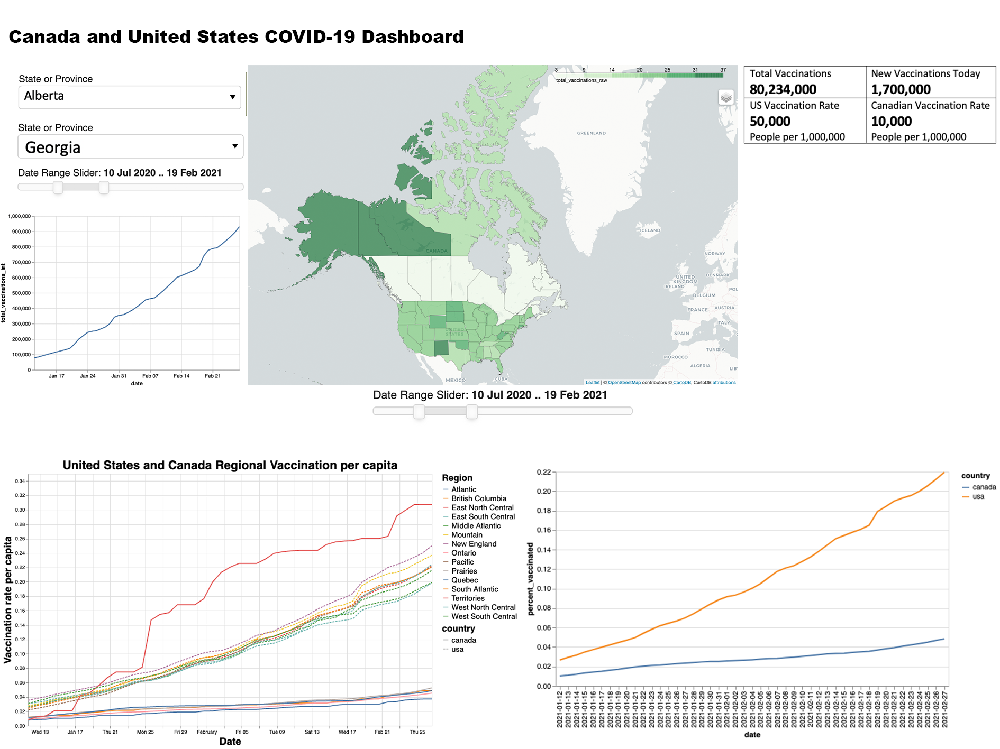

# DATA 551 - Dashboard Proposal

### Mitch DeCock, Thomson Hawks, Eric Phillips
February 27, 2021

Click this link to view the Milestone 1 Release of our public repo where we are building the functional components of the dashboard:

## [Milestone 1 Release](https://github.com/ubco-mds-2020-labs/covid_vaccine_dashboard/releases/tag/v1.0)

**NOTE: the `CONTRIBUTING.md` and `CODE_OF_CONDUCT.md` files are stored on our public project repository, linked above.**

**This milestone repository contains our proposal `proposal.md`, app description/sketch (below), and teamwork contract `work_contract.md`.**

### Description of app and sketch

Our dashboard will contain a landing page that shows a choropleth map of the United States and Canada containing the current population-adjusted cumulative vaccination administration for each state/province (as defined by the total number of vaccinations administered divided by population), as well as a slider allowing users to examine the map at a particular point in time. We also plan to include interactive line plots showing both the cumulative population-adjusted vaccination rates as well as the 7-day rolling mean of the daily chance in vaccinations for any given state/province, along with a comparison to the national average. We plan to allow users to select particular localities using either a drop-down menu or by clicking a particular region on the map. In addition to this, we plan to include high-level summary statistics for the overall vaccination progress of both the US and Canada to the right of our map. We also plan to include a section where users can make more detailed comparisons of specific metrics across specific localities, e.g. "Daily population-adjusted rolling mean of vaccination distribution for California vs. New York".

